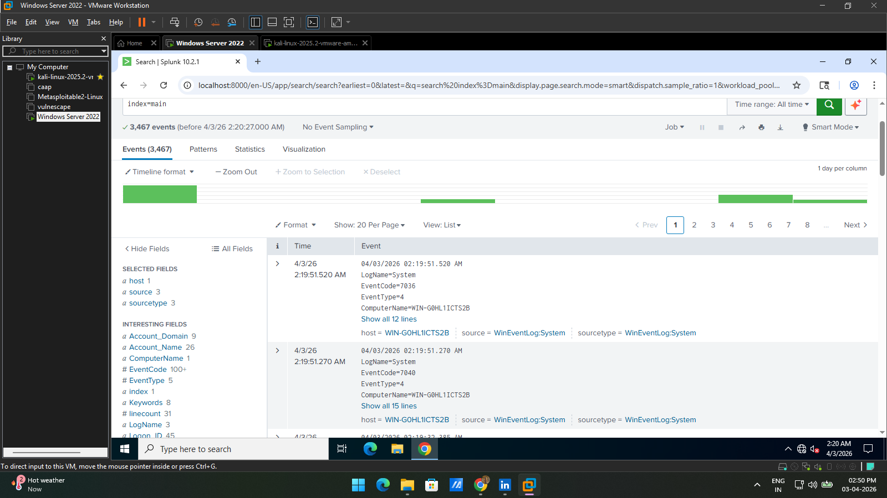
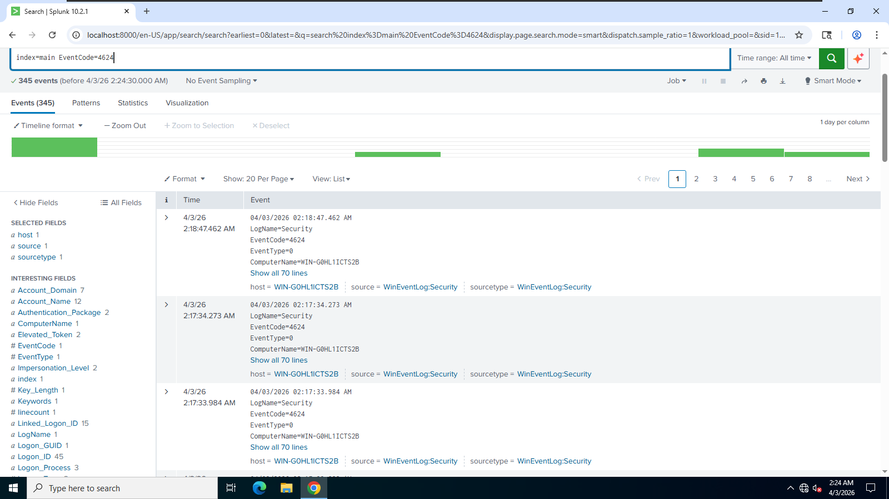
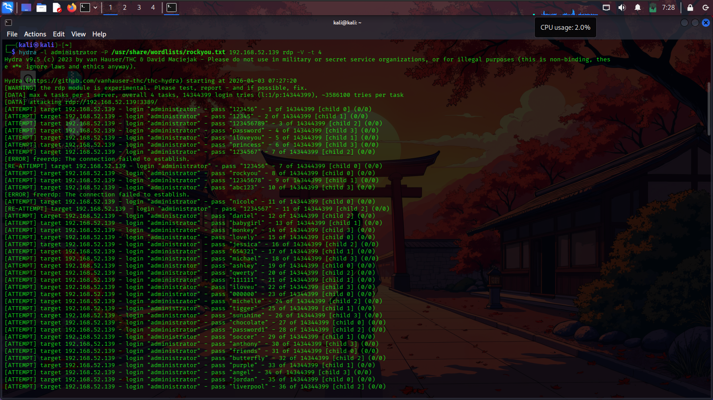
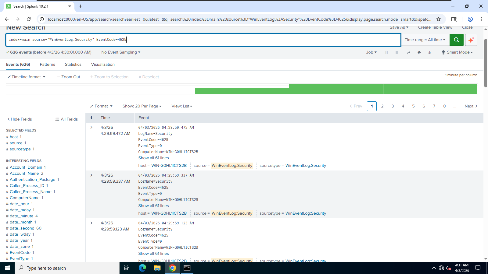
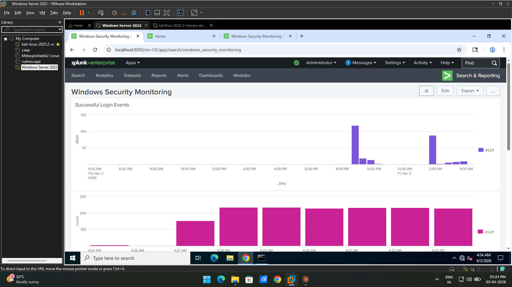
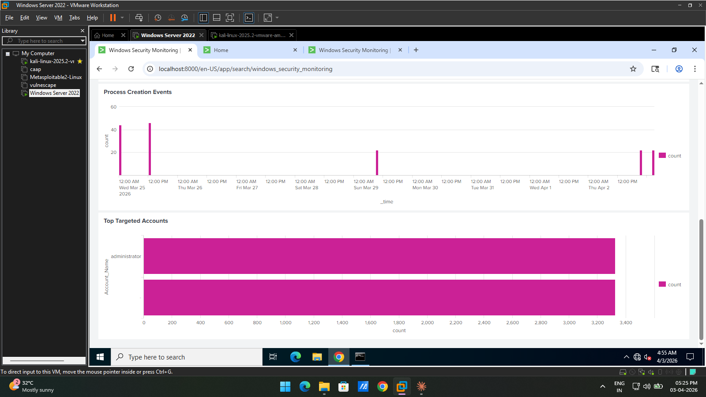
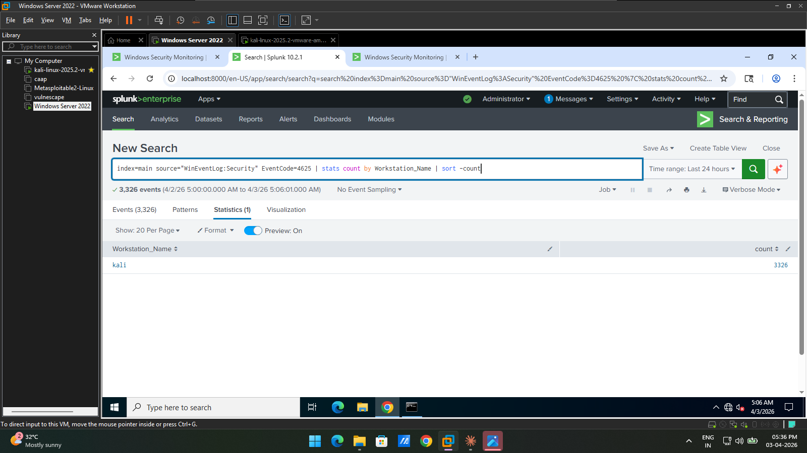

# Windows Log Analysis – Splunk SIEM Investigation


---

## Project Overview

As a SOC analyst, investigating Windows Event Logs is a core daily responsibility. 
This project demonstrates a real-world SOC workflow — collecting Windows Security 
logs into Splunk, analyzing authentication events, simulating a brute force attack, 
detecting it through SIEM investigation, and building a monitoring dashboard to 
support incident triage.

---

## Lab Architecture

| Component | System | IP Address | Role |
|-----------|--------|------------|------|
| Attacker | Kali Linux 2025.2 | 192.168.52.133 | Brute force simulation |
| Target | Windows Server 2022 | 192.168.52.139 | Generate security logs |
| SIEM | Splunk Enterprise 10.2.1 | 127.0.0.1:8000 | Log analysis & dashboard |

---

## SOC Workflow
---

## Screenshots

### Splunk – Security Log Collection

*Splunk ingesting Windows Security Event logs in real time — the starting point 
of any SOC investigation is confirming logs are flowing into the SIEM.*

---

### EventCode 4624 – Successful Login Investigation

*Investigating EventCode=4624 to establish a baseline of normal login activity 
before identifying anomalies — a standard SOC analyst technique.*

---

### Attack Simulation – Hydra Brute Force

*Hydra brute force attack launched from Kali Linux against RDP on Windows Server, 
generating a high volume of failed authentication attempts — MITRE ATT&CK T1110.*

---

### EventCode 4625 – Brute Force Detected in Splunk

*Splunk returned 626 EventCode=4625 failed logon events — a SOC analyst seeing 
this volume of failures in a short time would immediately flag this as a brute force attack.*

---

### SOC Monitoring Dashboard – Login Activity

*Custom Splunk dashboard built to monitor login activity — the brute force spike 
is clearly visible between 4:27–4:33 AM, exactly how it would appear in a real SOC.*

---

### SOC Monitoring Dashboard – Process & Account Monitoring

*Dashboard panels showing process creation events and top targeted accounts — 
the administrator account was targeted 3,200+ times during the attack window.*

---

### Investigation – Attacker Source Identified

*Log correlation confirmed the attack originated from workstation "kali" with 
3,326 failed login attempts — this is how a SOC analyst identifies the attack source.*

---

## Windows Event IDs Investigated

| Event ID | Name | SOC Relevance |
|----------|------|---------------|
| 4624 | Successful Logon | Baseline normal activity — monitor for anomalies |
| 4625 | Failed Logon | Primary indicator of brute force attacks |
| 4688 | Process Creation | Detect suspicious or malicious process execution |
| 4672 | Special Privileges | Indicates potential privilege escalation |

---

## Attack Detection

| Attack | Tool | Detection Method | MITRE ATT&CK |
|--------|------|-----------------|--------------|
| RDP Brute Force | Hydra | EventCode=4625 spike | T1110 – Brute Force |
| Credential Attack | Hydra | Workstation_Name correlation | T1078 – Valid Accounts |

---

## Splunk Queries Used
```splunk
# Investigate successful logins
index=main source="WinEventLog:Security" EventCode=4624

# Detect failed login attempts
index=main source="WinEventLog:Security" EventCode=4625

# Monitor process creation
index=main source="WinEventLog:Security" EventCode=4688

# Identify attack source
index=main source="WinEventLog:Security" EventCode=4625 
| stats count by Workstation_Name | sort -count

# Visualize attack timeline
index=main source="WinEventLog:Security" EventCode=4625 
| timechart count span=1m
```

---

## Tools Used

| Tool | Version | Purpose |
|------|---------|---------|
| Windows Server 2022 | Build 20348 | Target machine — log generation |
| Splunk Enterprise | 10.2.1 | SIEM — log collection and investigation |
| Kali Linux | 2025.2 | Attacker machine |
| Hydra | 9.5 | Brute force simulation |

---

## Author

**Muhammed Anshad**
Certified SOC Analyst (CSA) – EC-Council
[LinkedIn](https://www.linkedin.com/in/muhemmed-a501a0)
[GitHub](https://github.com/anshadshanu)
